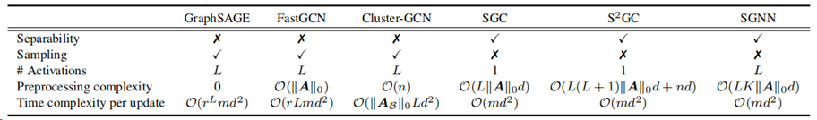

# Decouple Graph Neural Networks: Train Multiple Simple GNNs Simultaneously Instead of One

This repository is our implementation of 

>   Hongyuan Zhang, Yanan Zhu, and Xuelong Li,  "Decouple Graph Neural Networks: Train Multiple Simple GNNs Simultaneously Instead of One," *IEEE Transactions on Pattern Analysis and Machine Intelligence (T-PAMI)*, DOI: 10.1109/TPAMI.2024.3392782, 2024.[(arXiv)](https://arxiv.org/pdf/2304.10126.pdf)[(IEEE)](https://ieeexplore.ieee.org/document/10507024)

*SGNN* attempts to further reduce the training complexity of each iteration from $\mathcal{O}(n^2) / \mathcal{O}(|\mathcal E|)$ (vanilla GNNs without acceleration tricks, e.g., [AdaGAE](https://github.com/hyzhang98/AdaGAE)) and $\mathcal O(n)$ (e.g., [AnchorGAE](https://github.com/hyzhang98/AnchorGAE-torch)) to $\mathcal O(m)$. 

Compared with other fast GNNs, SGNN can

-   (**Exact**) compute representations exactly (without sampling);
-   (**Non-linear**) use up to $L$ non-linear activations ($L$ is the number of layers);
-   (**Fast**) be trained with the real stochastic (mini-batch based) optimization algorithms. 

The comparison is summarized in the following table. 





If you have issues, please email:

hyzhang98@gmail.com


## Requirements 

- pytorch 1.10.0
- scipy 1.3.1
- scikit-learn 0.21.3
- numpy 1.16.5


## How to run SGNN

>   Please ensure the data is rightly loaded

```
python run.py
python run_classfication.py
```


## Settings

### Node Classification

#### Cora

##### 

eta = 100, BP_count=5

```python
layers = [
    LayerParam(128, inner_act=linear_func, act=leaky_relu_func, gnn_type=LayerParam.EGCN,
               learning_rate=10**-2, order=1, max_iter=60, lam=10**-3, batch_size=2708),
    LayerParam(64, inner_act=linear_func, act=relu_func, gnn_type=LayerParam.EGCN,
               learning_rate=10**-2, order=1, max_iter=60, lam=10**-3, batch_size=2708),
    LayerParam(32, inner_act=linear_func, act=linear_func, gnn_type=LayerParam.EGCN,
               learning_rate=0.01, order=2, max_iter=60, lam=10**-3, batch_size=140),
]
```


#### Citeseer


eta = 100, BP_count = 3

```python
layers = [
    LayerParam(256, inner_act=relu_func, act=leaky_relu_func, gnn_type=LayerParam.EGCN,
               learning_rate=10**-2, order=1, max_iter=40, lam=10**-3, batch_size=1024),
    LayerParam(128, inner_act=relu_func, act=linear_func, gnn_type=LayerParam.EGCN,
               learning_rate=10**-3, order=1, max_iter=40, lam=10**-3, batch_size=140),
]
```


#### Pubmed

##### Setup

eta = 100, BP_count = 3

```python
layers = [
    LayerParam(256, inner_act=relu_func, act=leaky_relu_func, gnn_type=LayerParam.EGCN,
               learning_rate=10**-2, order=1, max_iter=100, lam=10**-3, batch_size=4096*2),
    LayerParam(128, inner_act=relu_func, act=leaky_relu_func, gnn_type=LayerParam.EGCN,
               learning_rate=10**-4, order=2, max_iter=40, lam=10**-3, batch_size=2048),
]
```


### Node Clustering


#### Cora

- mask_rate = 0.2
- overlook_rates=None
- layers=[128, 64,32]
- max_iter=200
- batch=128
- BP_count=10
- learning_rate=10^-3
- lam=10^-6
- eta=1, loss = loss1 / sample_size


### Pubmed

- mask_rate = 0.2
- overlook_rates=None
- layers=[256, 128]
- max_iter=100
- batch=4096
- BP_count=10
- learning_rate=10^-4 !
- lam=10^-6
- order=2

- eta=10, loss = loss1 
- AU -> relu
- activation  -> leaky_relu=5 

### Citeseer

- mask_rate = 0.2
- overlook_rates=None
- layers=[256, 128]
- max_iter=200
- batch=256
- BP_count=5
- learning_rate=10^-4 !
- lam=10^-6
- eta=10, loss = loss1 
- order=2
- AU -> leaky relu slope=0.2
- activation ->linear


### Reddit 

- mask_rate = 0.2
- overlook_rates=None
- layers=[128, 64]
- max_iter=10000
- batch=512
- BP_count=5
- learning_rate=10^-4 !
- lam=10^-6
- eta=10, loss = loss1 
- order=2
- AU -> relu
- activation ->linear

## Citation
```
@article{SGNN,
  author={Zhang, Hongyuan and Zhu, Yanan and Li, Xuelong},
  journal={IEEE Transactions on Pattern Analysis and Machine Intelligence}, 
  title={Decouple Graph Neural Networks: Train Multiple Simple GNNs Simultaneously Instead of One}, 
  year={2024},
  volume={},
  number={},
  pages={1-1},
  doi={10.1109/TPAMI.2024.3392782}
}
```